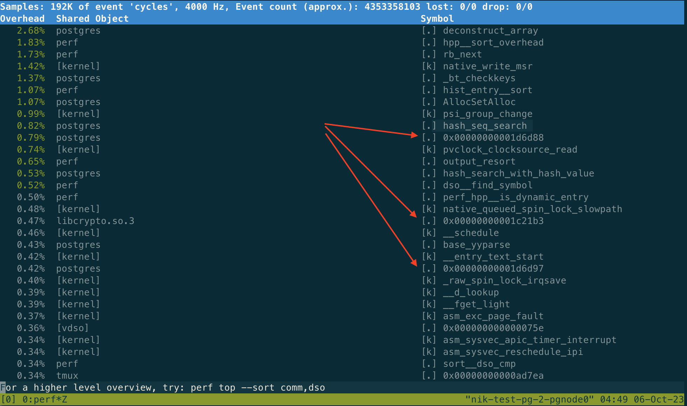
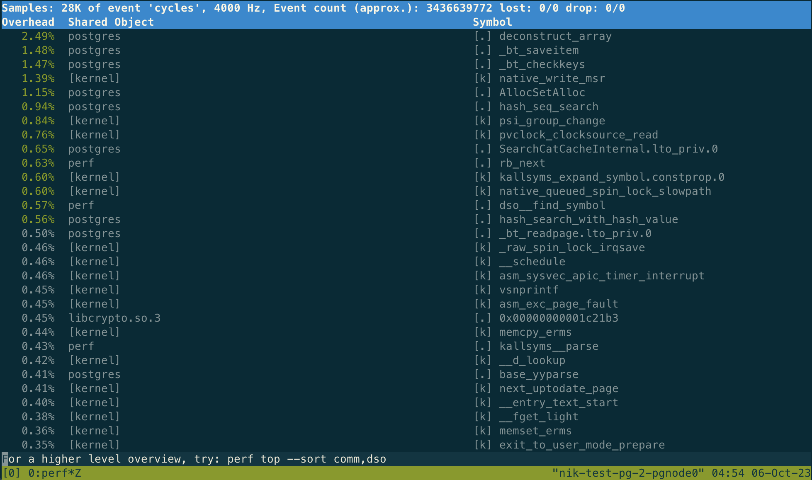
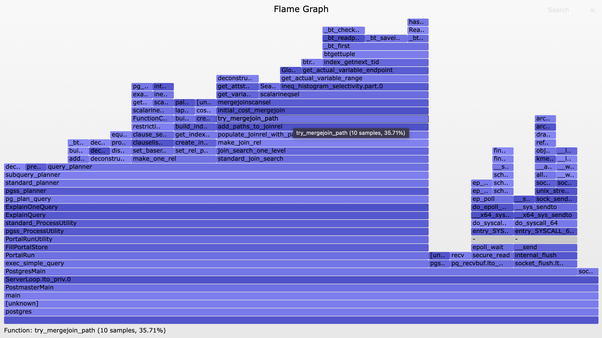

Originally from: [tweet](https://twitter.com/samokhvalov/status/1710176204953919574), [LinkedIn post](...).

---

# How to troubleshoot Postgres performance using FlameGraphs and eBPF (or perf)


Today we'll discuss how to understand what exactly a Postgres backend is doing inside CPU on a Linux machine (in-CPU analysis).

// Users of RDS and other managed Postgres services – sorry, this cannot be used in your case. Talk to your provider: you're paying much more than just for VM, but they give you only SQL level of access – that's not fair.

I'll keep this howto as simple as possible, and also demonstrate an interesting example that can be helpful in certain cases – we'll try to understand what's happening under the hood during query planning.

To perform in-CPU analysis, we'll be using [fantastic Brendan Gregg's flamegraphs](https://brendangregg.com/FlameGraphs/cpuflamegraphs.html).

Per Brendan Gregg, a flamegraph  is "a visualization of hierarchical data, created to visualize stack traces of profiled software so that the most frequent code-paths to be identified quickly and accurately" (discussed [here](https://brendangregg.com/flamegraphs.html))

To create a flamegraph, we need to perform a few quite simple steps:
1. Install tools to collect data for analysis. Two options here: tools for eBPF or `perf`.
2. Install packages with debug symbols for Postgres and, if needed, extensions we're using
3. Clone the FlameGraph repo
4. Get the process ID of the backend we're going to analyze
5. Collect data
6. Generate a flamegraph.

## Demo setup (schema and workload)
Before we discuss the analysis steps, here is what we're going to explore. The steps below are in psql connected to Postgres locally.

Table schema:
```sql
create table t1 as select i from generate_series(1, 1000000) i;
create table t2 as select i from generate_series(1, 10000000) i;
alter table t1 add primary key (i);
alter table t2 add primary key (i);
vacuum analyze;
```

Then run some Postgres planner's activity in an infinite loop:
```sql
select pg_backend_pid(); -- remember it for step 4
(but check again if Postgres is restarted)

explain select from t1
join t2 using (i)
where i between 1000 and 2000 \watch .01
```

– and leave it running.

Now, the analysis steps.

## Step 1: Install tools to collect data
Here we're going to install both `bcc-tools` (eBPF) and  `linux-tools-***` (`perf`) just to show how it works – but you may want to choose only one of them.

Example for eBPF and Ubuntu 22.04:
```shell
sudo apt update
apt install -y \
  linux-headers-$(uname -r) \
  bpfcc-tools # might be called bcc-tools
```

To install perf:
```shell
sudo apt update
sudo apt install -y linux-tools-$(uname -r)
```

If that didn't work, try checking what you have:
```shell
uname -r
sudo apt search linux-tools | grep $(uname -r)
```

This page has some good tips for `perf` installation, including a few words about working with containers:
- [perf, what’s that?](https://www.swift.org/server/guides/linux-perf.html)

One good way to use perf is to just run the top command:
```shell
perf top
```

– and observe what's happening with the system as a whole. Note that many functions will appear in unreadable form such as `0x00000000001d6d88` – memory addresses of some functions which names cannot be resolved:

<a href="./files/0010_perf_top_wo_debug_symbols.png">
  
</a>

This is because we don't have debug symbols for Postgres yet. Let's fix it.

## Step 2: Install Postgres debug symbols

I recommend having debug symbols – including all production systems.

For Postgres 16:
```shell
apt install -y postgresql-16-dbgsym
```

You may need more packages, for postgres-related software – for example:
```
apt search postgres | grep dbgsym
```

Note, though, that not every postgres-related package has `postgres` in its name, though – e.g., for pgBouncer, you need `pgbouncer-dbgsym`.

Once packages with debug symbols are installed, it is important not to forget to restart Postgres (and our infinite loop with `EXPLAIN .. \watch` in `psql`).

Now `perf top` is going to look much better – all the Postgres-related lines have function names:

<a href="./files/0010_perf_top_w_debug_symbols.png">
  
</a>

## Step 3: Get FlameGraph tooling
```shell
git clone https://github.com/brendangregg/FlameGraph
cd FlameGraph
```

## Step 4: Get Postgres PID
If you need to know the PID of Postgres backend you're dealing with:
```sql
select pg_backend_pid();
```

If you have something already running, a different session, you can use pg_stat_activity, for example:
```sql
select pid, query
from pg_stat_activity
where
  application_name = 'psql'
  and pid <> pg_backend_pid();
```

Once we know the PID, let's remember it in a variable:
```shell
export PGPID=<your value>
```

## Step 5: Collect data for analysis
eBPF version, collecting data for process with pid `$PGPID` during 10 seconds:
```shell
profile-bpfcc -p $PGPID -F 99 -adf 10 > out
```

If you prefer `perf`:
```shell
perf record -F 99 -a -g -- sleep 10
perf script | ./stackcollapse-perf.pl > out
```

## Step 6: Generate a flamegraph
```shell
./flamegraph.pl --colors=blue out > profile.svg
```

## Result
That's it. Now you need to copy `profile.svg` to your machine and open it in, for example, a browser – it will show this SVG file and, moreover, clicking on various areas of it is supported (really helpful for exploring various areas).

Here is the result for our process running an infinite EXPLAIN loop:

<a href="./files/0010_flamegraph.png">
  
</a>

It's very interesting that ~35% of CPU time is spent to analyzing if `Merge Join` is worth using, while eventually the planner picks a `Nested Loop`:
```
postgres=# explain (costs off) select
from t1 join t2 using (i)
where i between 1000 and 2000;
                    QUERY PLAN
---------------------------------------------------
 Nested Loop
   ->  Index Only Scan using t1_pkey on t1
         Index Cond: ((i >= 1000) AND (i <= 2000))
   ->  Index Only Scan using t2_pkey on t2
         Index Cond: (i = t1.i)
(5 rows)
```

In this case, the planning time is really low, sub-millisecond – but I encountered with cases, when planning happened to be extremely slow, many seconds or even dozens of seconds. And it turned out (thanks to flamegraphs!) that analyzing the Merge Join paths was the reason, so with "set enable_mergejoin = off" the planning time dropped to very low, sane values. But this is another story.

## Some good mate
- Brendan Gregg's books: "Systems Performance" and "BPF Performance Tools"
- Brendan Gregg's talks – for example, ["eBPF: Fueling New Flame Graphs & more • Brendan Gregg"](https://youtube.com/watch?v=HKQR7wVapgk) (video, 67 min)
- [Profiling with perf](https://wiki.postgresql.org/wiki/Profiling_with_perf) (Postgres wiki)

---

Was it useful? Let me know – and please share with your colleagues and friends who use #PostgreSQL!
