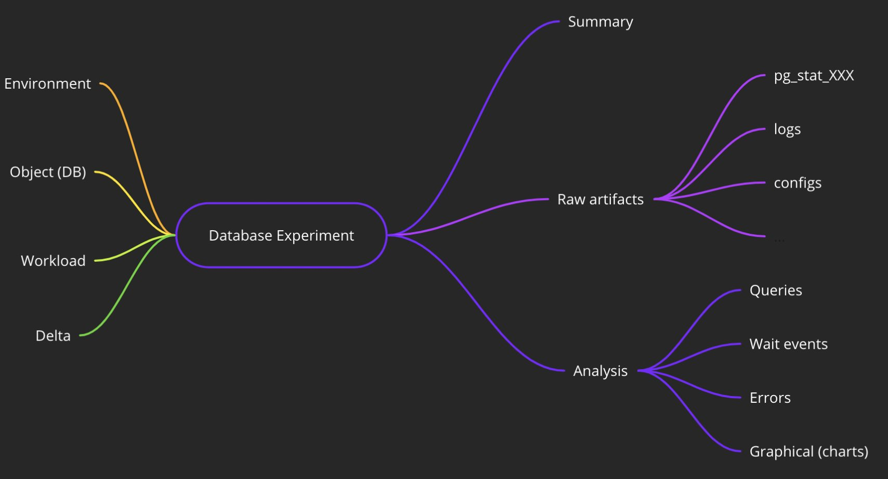

Originally from: [tweet](https://twitter.com/samokhvalov/status/1711237471743480060), [LinkedIn post](...).

---

# How to benchmark

> I post a new PostgreSQL "howto" article every day. Join me in this
> journey – [subscribe](https://twitter.com/samokhvalov/), provide feedback, share!

Benchmarking is a huge topic. Here, we cover minimal steps that are required for a Postgres benchmark to be informative,
useful, and correct.

In this article, we assume that the following principles are followed:

1. **NOT A SHARED ENV:** The whole machine is under our solely use (nobody else is using it), we aim to study the
   behavior
   of Postgres as a whole, with all its components (vs. microbenchmarks such as studying a particular query via using
   `EXPLAIN` or focusing on underlying components such as disk and filesystem performance).

2. **HIGH QUALITY:** We aim to be honest (no "benchmarketing" goals), transparent (all details are shared), precise, and
   fix all mistakes when/if they happen. When it makes sense, each benchmark run should be long enough to take into
   account factors like colder state of caches or various fluctuations. There should be also multiple runs of each type
   of benchmark (usually, at least 4-5), to ensure that runs are reproducible. It makes sense to learn from existing
   experience: excellent [Brendan Gregg's book "System
   Performance"](https://brendangregg.com/blog/2020-07-15/systems-performance-2nd-edition.html) has a chapter about
   benchmarks; it may also be useful to learn from other fields (physics, etc.), to understand the principles and
   methodologies of [successful experiments](https://en.wikipedia.org/wiki/Experiment).

3. **READY TO LEARN:** We have enough expertise to understand the bottlenecks and limitations or ready to use other
   people's help, re-making benchmarks if needed.

## Benchmark structure

Benchmark is a kind of database experiment, where, in general case, we use multiple sessions to DBMS and study the
behavior of the system as a whole, and it's all or particular components (e.g., buffer pool, checkpointer, replication).

Each benchmark run should have a well-defined structure. In general, it contains two big parts:

1. **INPUT:** everything we have or define before conducting the database – where we run the benchmark, how the system
   was
   configured, what DB and workload we use, what change we aim to study (to compare the behavior before and after the
   change).
2. **OUTPUT:** various observability data such as logs, errors observed, statistics, etc.

Each part should be well-documented so anyone can reproduce the experiment, understand the main metrics (latency,
throughput, etc.), understand bottlenecks, conduct additional, modified experiments if needed.

The description of all aspects of database benchmarking could take a whole book – here I provide only basic
recommendations that can help you avoid mistakes and improve the general quality of your benchmarks.

Of course, some of the things can be omitted, if needed. But in general case, it is recommended to automate
documentation and artifact collection for all experiments, so it would be easy to study the details later. You can
find [here](https://gitlab.com/postgres-ai/postgresql-consulting/tests-and-benchmarks/-/issues)
some good examples of benchmarks performed for specific purposes (e.g., to study pathological subtransaction behavior or
to measure the benefits of enabling `wal_compression`).

## INPUT: Environment

- Make sure you're using machines of a proper size, don't run on laptop (unless absolutely necessary). AWS Spot or GCP
  Preemptible instances, used during short periods of time, are extremely affordable and super helpful for
  experimenting. For example, spot instances for VMs with 128 Intel or AMD vCPUs and 256-1024 GiB of RAM have hourly
  price as low as $5-10 ([good comparison tool](https://instances.vantage.sh)), billed by second – this enables very
  cost-efficient experiments on large machines.
- When you get VMs, quickly check them with microbenchmark tools such as fio, sysbench to ensure that CPU, RAM, disk,
  network work as advertised. If in doubts, compare to other same-type VMs and choose.
- Document VM tech spec, disk, and filesystem (these two are extremely important for databases!), OS choices, and
  non-default settings.
- Document Postgres version used and additional extensions, if any (some of them can have "observer effect" even if they
  are just installed).
- Document non-default Postgres settings used.

## INPUT: Database

- Document what schema and data you use. Ideally, in a fully reproducible form (SQL / dump).

## INPUT: Workload

- Document all the aspects of the workload you've used – ideally, in a fully reproducible form (SQL, pgbench, sysbench,
  etc. details).
- Understand the type of your benchmark, the kind of load testing you're aiming to have: is it edge-case load testing 
  (stress testing) when you aim to go "full speed" or regular load testing, in which you try to simulate real-life
  situation when, for example, CPU usage is normally far below 100%. Note that by default, pgbench tends to give you
  "stress testing" (not limiting the number of TPS – to limit it, use option `-R`).

## INPUT: Delta

There may be various types of "deltas" (the subject of our study that define the difference between runs). Here are just
some examples:

- different Postgres minor or major versions
- different OS versions
- different settings such as `work_mem`
- different hardware
- varying scale: different number of clients working with database or different table sizes
- different filesystems

It is not recommended to consider schema changes of changes in SQL queries as "delta" because:

- such workload changes usually happen at a very high pace
- full-fledged benchmarking is very expensive
- it is possible to study schema and query changes in shared environments, focusing on IO metrics (BUFFERS!), achieving
  high level of time and cost efficiency (see [@Database_Lab](https://twitter.com/Database_Lab))

## OUTPUT: collect artifacts

It is worth collecting a lot of various artifacts and making sure they will not be lost (e.g., upload them to an object
storage).

- Before each run, reset all statistics, using `pg_stat_reset()`, `pg_stat_reset_shared(..)`, other standard
  `pg_stat_reset_***()` functions ([docs](https://postgresql.org/docs/current/monitoring-stats.html)),
  `pg_stat_statements_reset()`, `pg_stat_kcache_reset()`, and so on.
- After each run, dump all `pg_stat_***` views in CSV format.
- Collect all Postgres logs and any other related logs (e.g., pgBouncer's, Patroni's, syslog).
- While Postgres, pgBouncer or any other configs are "input", it makes sense to create a snapshot of all actual observed
  configuration values (e.g., `select * from pg_settings;`) and consider this data as artifacts as well.
- Collect the query analysis information: snapshot of `pg_stat_statements`, `pg_stat_kcache`, `pg_wait_sampling`
  / [pgsentinel](https://github.com/pgsentinel/pgsentinel), etc.
- Extract all information about errors from (a) logs, (b) `pg_stat_database` (`xact_rollback`) and similar places via
  SQL,
  and consider this a separate, important type of artifact for analysis. Consider using a small extension called
  [logerrors](https://github.com/munakoiso/logerrors) that will register all error codes and expose them via SQL.
- If monitoring is used, collect charts from there. For experiments particularly, it may be convenient to use
  [Netdata](https://netdata.cloud) since it's really easy to install on a fresh machine, and it has dashboard
  export/import functions (unfortunately, they are client-side, hence manual actions are always needed; but, I
  personally find them very convenient when conducting DB experiments).

## Analysis

Some tips (far from being complete):

1. Always check errors. It's not uncommon to have a benchmark run, jump into some conclusion, and only later realize
   that the error count was too high, making the run not useful.
2. Understand where the bottleneck is. Very often, we are saturated, say, on disk IO, and think we observe behavior of
   our database system, but we actually observe the behavior of, say, cloud disk throttling or filesystem limitations
   instead. In such cases we need to think how to tune our input to avoid such bottlenecks, to perform useful
   experiments.
3. In some cases, it is, vice versa, very desired to reach some kind saturation – for example, if we study the speed of
   `pg_dump` or `pg_restore`, we may want to observe our disk system saturated, and we tune the input (e.g. how exactly
   we `pg_dump` – how many parallel workers we use, is compression involved, is network involved, etc.) so the desired
   saturation is indeed reached, and we can demonstrate it.
4. Understand the main metrics you're going to compare between runs – latencies, throughput numbers, query analysis
   metrics (those from `pg_stat_statements`, wait event analysis), and so on.
5. Develop a good format of summary and follow this format. It can include short description of various input parts,
   including workload delta, and main comparison metrics. Store all the summaries for all runs in this well-structured
   form.
