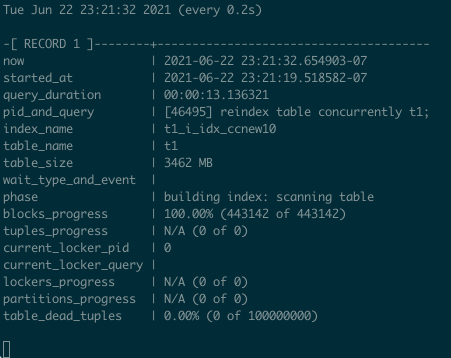

Originally from: [tweet](https://twitter.com/samokhvalov/status/1711982079838507225), [LinkedIn post](...).

---

# How to monitor CREATE INDEX / REINDEX progress in Postgres 12+

> I post a new PostgreSQL "howto" article every day. Join me in this
> journey – [subscribe](https://twitter.com/samokhvalov/), provide feedback, share!

To monitor the progress of long-running index building or rebuilding, you can use this query:

```sql
select
   now(),
   query_start as started_at,
   now() - query_start as query_duration,
   format('[%s] %s', a.pid, a.query) as pid_and_query,
   index_relid::regclass as index_name,
   relid::regclass as table_name,
   (pg_size_pretty(pg_relation_size(relid))) as table_size,
   nullif(wait_event_type, '') || ': ' || wait_event as wait_type_and_event,
   phase,
   format(
           '%s (%s of %s)',
           coalesce((round(100 * blocks_done::numeric / nullif(blocks_total, 0), 2))::text || '%', 'N/A'),
           coalesce(blocks_done::text, '?'),
           coalesce(blocks_total::text, '?')
   ) as blocks_progress,
   format(
           '%s (%s of %s)',
           coalesce((round(100 * tuples_done::numeric / nullif(tuples_total, 0), 2))::text || '%', 'N/A'),
           coalesce(tuples_done::text, '?'),
           coalesce(tuples_total::text, '?')
   ) as tuples_progress,
   current_locker_pid,
   (select nullif(left(query, 150), '') || '...' from pg_stat_activity a where a.pid = current_locker_pid) as current_locker_query,
   format(
           '%s (%s of %s)',
           coalesce((round(100 * lockers_done::numeric / nullif(lockers_total, 0), 2))::text || '%', 'N/A'),
           coalesce(lockers_done::text, '?'),
           coalesce(lockers_total::text, '?')
   ) as lockers_progress,
   format(
           '%s (%s of %s)',
           coalesce((round(100 * partitions_done::numeric / nullif(partitions_total, 0), 2))::text || '%', 'N/A'),
           coalesce(partitions_done::text, '?'),
           coalesce(partitions_total::text, '?')
   ) as partitions_progress,
   (
      select
         format(
                 '%s (%s of %s)',
                 coalesce((round(100 * n_dead_tup::numeric / nullif(reltuples::numeric, 0), 2))::text || '%', 'N/A'),
                 coalesce(n_dead_tup::text, '?'),
                 coalesce(reltuples::int8::text, '?')
         )
      from pg_stat_all_tables t, pg_class tc
      where t.relid = p.relid and tc.oid = p.relid
   ) as table_dead_tuples
from pg_stat_progress_create_index p
        left join pg_stat_activity a on a.pid = p.pid
order by p.index_relid
; -- in psql, use "\watch 5" instead of semicolon
```

The same query, in [a better formatted form](https://gitlab.com/-/snippets/2138417).

How this query works:

1. The basis of it
   is `pg_stat_progress_create_index` [added in Postgres 12](https://postgresql.org/docs/current/progress-reporting.html#CREATE-INDEX-PROGRESS-REPORTING).

2. The documentation also has a list of `CREATE INDEX` phases. As you can see from the table provided in the docs,
   advanced variant, `CREATE INDEX CONCURRENTLY` / `REINDEX CONCURRENTLY` (a.k.a. CIC and RC), which takes longer but
   acts in a non-blocking fashion suitable for loaded production systems, has more phases. The current phase is
   presented in the column "phase" of the output.

3. Index name (a temporary one in case of CIC/RC), table name are presented (using the useful trick to convert OIDs to
   names – note, e.g., `index_relid::regclass as index_name`). Additionally, the table size which is essential to form
   expectations of overall duration – the bigger the table is, the longer the index creation is going to take.

4. `pg_stat_activity` (`pgsa`) provides a lot of additional useful information:
    - PID of Postgres backend
    - actual SQL query used
    - the moment when the work has started (`query_start`), allowing us to understand the elapsed
      time (`query_duration`)
    - `wait_event_type` & `wait_event` to understand what the process is currently waiting on
    - it also used (in a separate sub-query) to get the information of the session that blocks our process, when such an
      event occurs (`current_locker_pid`, `current_locker_query`)

5. Function `format(...)` is very useful to consolidate data in convenient form without having to worry about `NULL`s,
   that
   would be a problem if we used a regular concatenation without `coalesce(...)`.

6. However, in certain cases we use `coalesce(...)` just to put special symbols if the value is missing (`IS NULL`) –
   e.g., "?" or "N/A".

7. Another interesting trick is combination of `coalesce(...)` and `nullif(...)`. The latter allows us to avoid division
   by
   zero errors (replacing `0` with `NULL`, making the division result also `NULL`), while the former, again, is used to
   substitute resulting `NULL` with some non-empty value (in this case, 'N/A').

When executed in `psql`, it can be convenient to use `\watch [seconds]` to run this report in loop and observe progress
live:


