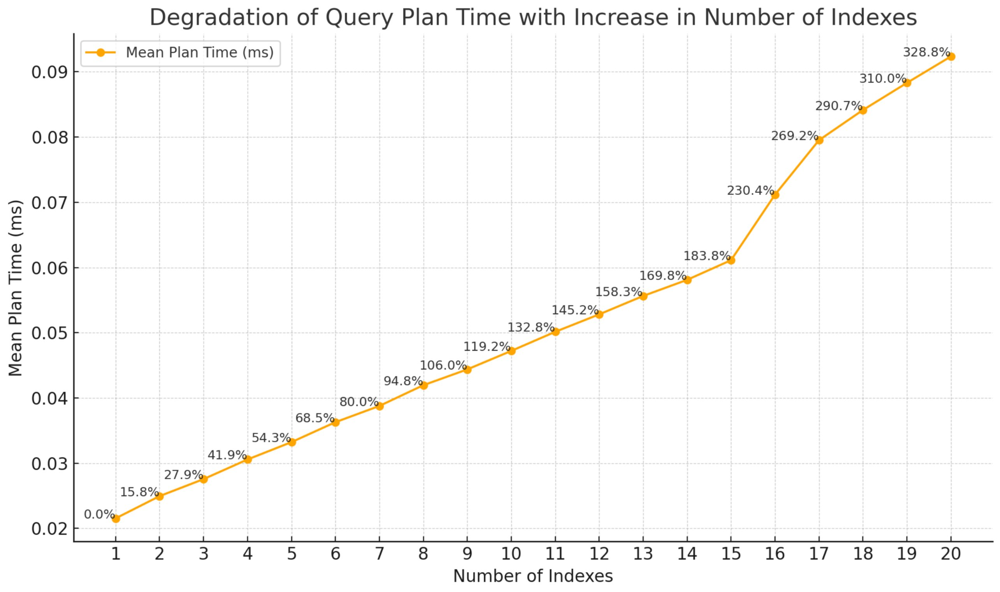
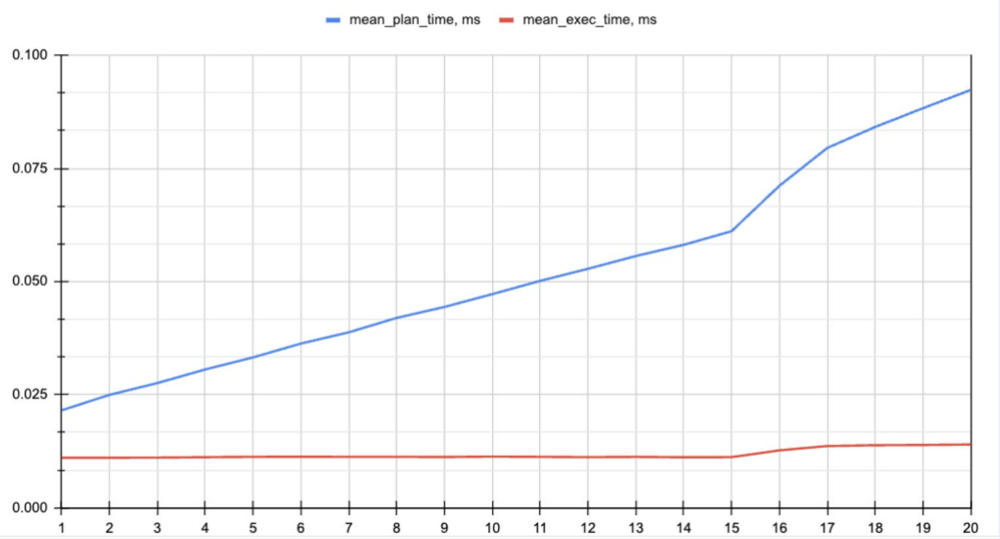
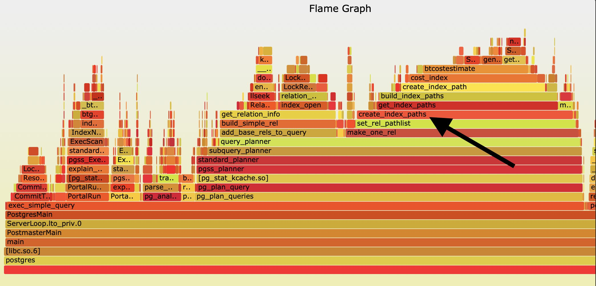

Originally from: [tweet](https://twitter.com/samokhvalov/status/1713101666629927112), [LinkedIn post](...).

---

# Over-indexing

> I post a new PostgreSQL "howto" article every day. Join me in this
> journey – [subscribe](https://twitter.com/samokhvalov/), provide feedback, share!

Everyone knows that each additional index is going to slow down writes (`INSERT`, `UPDATE` – unless it's **HOT**).
But bear with me today and I promise you'll be very surprised.

## Indexes and write overhead

Obviously, if you create a new index, then with each statement that produces new row versions (`INSERT`, `UPDATE`), Postgres needs to update this index too – this means, write statements are going to take longer to execute.

For `UPDATE`s, there is a special optimization – **HOT updates**, **Heap-Only-Tuple updates** – that might let Postgres
avoid such overhead. This can happen if two conditions are met:

- `UPDATE` doesn't involve columns that participate in index definition (considering *all* indexes; with one exclusion:
  `BRIN` indexes in Postgres versions 16+ are skipped in this check, thanks to a special optimization), and
- there is free space in the page where the tuple being updated is currently located.

Docs: [Heap-Only Tuples (HOT)](https://postgresql.org/docs/current/storage-hot.html).

And in this article I consider a less trivial situation, in which trying to optimize the index set, we're losing HOT
completely (meaning that `UPDATE`s become slower):

- [How partial, covering, and multicolumn indexes may slow down UPDATEs in PostgreSQL](https://postgres.ai/blog/20211029-how-partial-and-covering-indexes-affect-update-performance-in-postgresql)

Leaving HOT updates aside, the bottom line is pretty straightforward: the more indexes you have, the slower the writes.

What to do: avoid over-indexing, add new indexes wisely, perform index maintenance regularly, dropping unused and
redundant indexes.

## Indexes and planning time

Now, let's look at some less straightforward cases.

Here is a [benchmark](https://gitlab.com/postgres-ai/postgresql-consulting/tests-and-benchmarks/-/issues/41)
where [@VKukharik](https://twitter.com/VKukharik) showed that with each extra index, the planning
time of a simple `SELECT` (a PK lookup) noticeably degrades (thanks
to [@Adrien_nayrat](https://twitter.com/Adrien_nayrat) for the great tip about planning
time):



Compared to the execution time:



– the table with 1 index has a planning time that is more than 4x better, and in this particular case, it's
significantly higher than the execution time.

This happens because for each index, Postgres planner needs to analyze more options for execution. Here
is a flamegraph for the same query on the same table with 32 indexes
([source](https://gitlab.com/postgres-ai/postgresql-consulting/tests-and-benchmarks/-/issues/41#note_1602558372)):



The most significant negative effect on overall latency can be observed for simple `SELECT`s, where execution time is
low and, with a lot of indexes, might be much lower than the planning time.

What to do:

1. Reduce the number of indexes.
2. Consider using prepared statements. If you have pgBouncer running in `pool_mode=transaction`, you could not use
   prepared statements due to lack of support of them by pgBouncer in this pool mode, historically. However, in October
   2023, this feature was [implemented](https://github.com/pgbouncer/pgbouncer/pull/845) 🎉 (and released
   in [PgBouncer 1.21.0 - "The one with prepared statements"](https://github.com/pgbouncer/pgbouncer/releases/tag/pgbouncer_1_21_0)).
   Some other poolers also support it (`odyssey`, `pgcat`) or plan to support (`supavisor`).

## Indexes and fastpath=false (LWLock:LockManager contention)

Have you noticed on the pictures above that when we reach index count 15, the nature of the curves changes, showing a
worse degradation than the linear trend that was observed before?

Let's understand why this happens and how to deal with it.

For a single table PK lookup, when executing a query (and planning too - it's enough to run a plain EXPLAIN without
executing it to see), Postgres acquires AccessShareLock on the table and **all its indexes**. This can be surprising.
Corresponding source code:
[plancat.c](https://gitlab.com/postgres/postgres/blob/0002feb8209618e5a9e23e03fe4aa31bc4006f01/src/backend/optimizer/util/plancat.c#L200).

How to check it – assuming we have a table `t1`:

- in one session, run:
  ```sql
  select pg_backend_pid(); -- remember PID
  begin;
  explain select from t1 where id = 1; -- and keep tx open
  ```

- In another session:
  ```sql
  select * from pg_locks where pid = {{PID}}; -- use the PID above
  ```

You will see that for N indexes on `t1`, N+1 `AccessShareLock` relation-level locks have been acquired.

For first 16 locks, you'll see `true` in the `pg_locks.fastpath` column. For 17th and further, it is going to be
`false`. This threshold is hard-coded in constant
[FP_LOCK_SLOTS_PER_BACKEND](https://gitlab.com/postgres/postgres/blob/22655aa23132a0645fdcdce4b233a1fff0c0cf8f/src/include/storage/proc.h#L85).
When `fastpath=false`, Postgres lock manager uses a slower, but more comprehensive method to acquire locks. Details can
be found
[here](https://gitlab.com/postgres/postgres/blob/22655aa23132a0645fdcdce4b233a1fff0c0cf8f/src/backend/storage/lmgr/README#L70).

In a highly concurrent environment , if we have `fastpath=false` locks, we might start observing `LWLock` contention,
sometime a serious one – a lot of active sessions with `wait_event='LockManager'` (or `lock_manager` in PG13 or older)
in `pg_stat_activity`.

This might happen both on the primary or on replicas, when two conditions are met:

1. High QPS – say 100 or more (depending on workload and hardware resources) for the observed query
2. `fastpath=false` locks due to more than 16 relations involved (in Postgres, both tables and indexes are considered
   "relations") – either over-indexing, or too many tables involved in query (for example, partitioned table and lack of
   partition pruning in plans), or a combination of these factors.

The threshold `FP_LOCK_SLOTS_PER_BACKEND=16` is, as already mentioned, hard-coded. Per October 2023, there is an ongoing
discussion in -hackers to review this constant (thanks,
[@fuzzycz](https://twitter.com/fuzzycz), for drafting
the [patches](https://postgresql.org/message-id/flat/116ef01e-942a-22c1-a2af-35bf69c1b07b%40enterprisedb.com#b19340c248755be70b805404becd43ad)!)

What to do?

1. First, avoid over-indexing. Particularly, try to keep the number of indexes as low as possible on tables that are
   involved (or planned to be involved) in queries with high frequency (high QPS).
2. If you partition tables, make sure, again, you don't over-index and that query plans involve only certain
   partitions (partition pruning).
3. If having too many indexes is inevitable, try to reduce QPS for the corresponding queries.
4. Another option to reduce contention is to enhance your cluster's performance: use faster machines and offload
   read-only queries to additional replicas.

A couple of good reads on this topic:

- Useful docs RDS Postgres (useful for non-RDS users
  too): [LWLock: lockmanager](https://docs.aws.amazon.com/AmazonRDS/latest/UserGuide/wait-event.lw-lock-manager.html)
- [Postgres Partition Pains - LockManager Waits](https://kylehailey.com/post/postgres-partition-pains-lockmanager-waits)
  by [@kylelf_](https://twitter.com/kylelf_)

