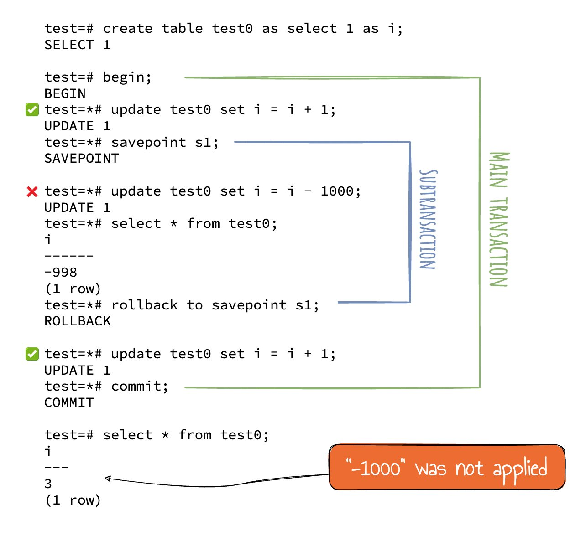
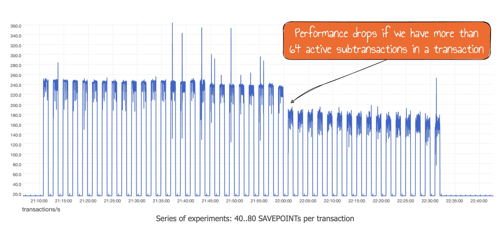
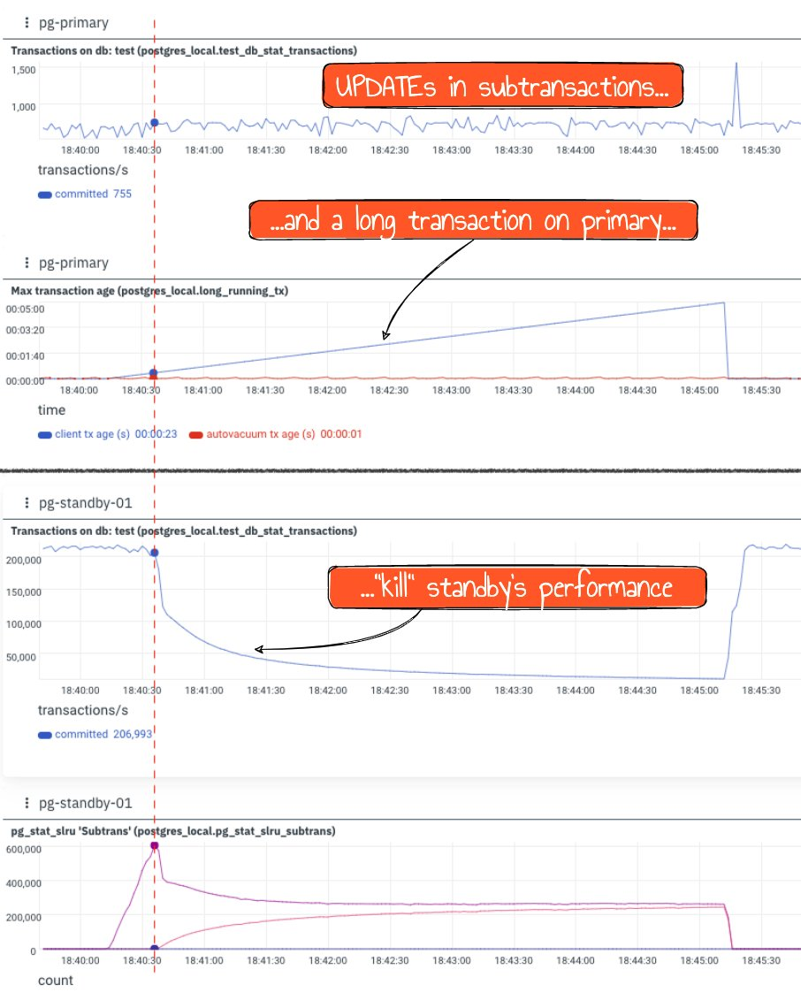

Originally from: [tweet](https://twitter.com/samokhvalov/status/1719228501658882268), [LinkedIn post]().

---

# How to use subtransactions in Postgres

> I post a new PostgreSQL "howto" article every day. Join me in this
> journey – [subscribe](https://twitter.com/samokhvalov/), provide feedback, share!

## TL;DR

Don't use subtransactions, unless absolutely necessary.

## What are subtransactions?

A subtransaction, also known as "nested transaction", is a transaction started by instruction within the scope of an
already started transaction (src: [Wikipedia](https://en.wikipedia.org/wiki/Nested_transaction)). This feature allows
users to partially roll back a transaction, which is helpful in many cases: fewer steps need to be repeated to retry the
action if some error occurs.

The SQL standard defines two basic instructions describing this mechanism: `SAVEPOINT` and extension to the `ROLLBACK`
statement – `ROLLBACK TO SAVEPOINT`. Postgres implements it, allowing slight deviations from the standard syntax – for
example, allowing the omission of the word `SAVEPOINT` in the `RELEASE` and `ROLLBACK` statements.

You might be already using subtransactions, for example:

- In Django, using nested ["atomic()" blocks](https://docs.djangoproject.com/en/5.0/topics/db/transactions/#savepoints).
- Implicitly: using the `BEGIN / EXCEPTION WHEN ... / END` blocks in PL/pgSQL functions.

## How to use (if you really want)

Syntax:

- `SAVEPOINT savepoint_name` ([SAVEPOINT](https://postgresql.org/docs/current/sql-savepoint.html))
- `ROLLBACK [ WORK | TRANSACTION ] TO [ SAVEPOINT ] savepoint_name`
  ([ROLLBACK TO](https://postgresql.org/docs/current/sql-rollback-to.html))
- `RELEASE [ SAVEPOINT ] savepoint_name` ([RELEASE SAVEPOINT](https://postgresql.org/docs/current/sql-release-savepoint.html))

An example:

## Recommendations

The only actual recommendation I have for any project that aims to grow OLTP-like workload (web and mobile apps) is:

> wherever possible, avoid subtransactions

...if you don't want this to happen one day:

...or this:

You can find the detailed analysis of four dangers of subtransactions in
[PostgreSQL Subtransactions Considered Harmful](https://postgres.ai/blog/20210831-postgresql-subtransactions-considered-harmful).

As of 2023 / PG16, these issues are not yet solved, although there is some work in progress to implement various
optimizations:

- [More scalable multixacts buffers and locking](https://commitfest.postgresql.org/45/2627/)
- [suboverflowed subtransactions concurrency performance optimize](https://postgresql.org/message-id/flat/003201d79d7b%24189141f0%2449b3c5d0%24%40tju.edu.cn)
  (unfortunately, patch reverted)

As a bottom line:

1. If you can, don't use subtransactions
2. Keep an eye on pgsql-hackers threads related to them and if you can, participate (help test and improve)
3. If absolutely necessary, then
   study [Problem 3: unexpected use of Multixact IDs](https://postgres.ai/blog/20210831-postgresql-subtransactions-considered-harmful#problem-3-unexpected-use-of-multixact-ids)
   and:
    - use them in lower-TPS systems only
    - avoid deep nesting
    - be very careful with `SELECT ... FOR UPDATE` in transactions that include subtransactions
    - monitor the `pg_stat_slru` numbers (
      PG13+, [Monitoring stats](https://postgresql.org/docs/current/monitoring-stats.html)) to quickly
      notice and troubleshoot SLRU overflow if it happens
