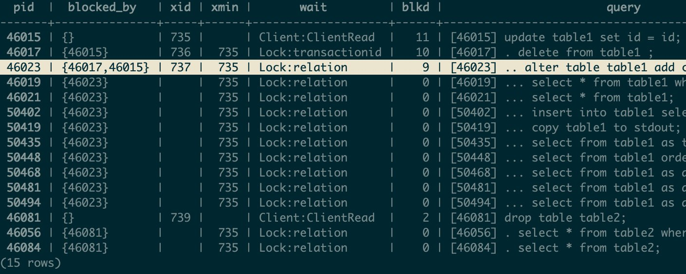

Originally from: [tweet](https://twitter.com/samokhvalov/status/1721799840886387097), [LinkedIn post]().

---

# How to analyze heavyweight locks, part 2: Lock trees (a.k.a. "lock queues", "wait queues", "blocking chains")

> I post a new PostgreSQL "howto" article every day. Join me in this
> journey – [subscribe](https://twitter.com/samokhvalov/), provide feedback, share!

See also [Part 1](0022_how_to_analyze_heavyweight_locks_part_1.md).

Good sources of knowledge:

- [13.3. Explicit Locking](https://postgresql.org/docs/current/explicit-locking.html) – the docs (despite the title,
  it's only about the explicit locking).
- [PostgreSQL rocks, except when it blocks: Understanding locks (2018)](https://citusdata.com/blog/2018/02/15/when-postgresql-blocks/),
  a blog post by [@marcoslot](https://twitter.com/marcoslot)
- Egor Rogov's book [PostgreSQL 14 Internals](https://postgrespro.com/community/books/internals), Part III "Locks".
- [PostgreSQL Lock Conflicts](https://postgres-locks.husseinnasser.com) – a reference-like tool by
  [@hnasr](https://twitter.com/hnasr) to study the relationships between various lock types and what types of locks
  various SQL commands acquire.

When locking issues occur, we usually need to:

1. Understand the nature and the scale of the problem.
2. Consider terminating the initial "offending" sessions
   – tree roots – to stop the storm ASAP (usually, using `select pg_terminate_backend(<pid>);`).

Here is an advanced query that, in general case, shows the "forest of lock trees" (since there might be several "root"
sessions, from which multiple "trees" grow):

```sql
\timing on
set statement_timeout to '100ms';

with recursive activity as (
  select
    pg_blocking_pids(pid) blocked_by,
    *,
    age(clock_timestamp(), xact_start)::interval(0) as tx_age,
    -- "pg_locks.waitstart" – PG14+ only; for older versions:  age(clock_timestamp(), state_change) as wait_age
    age(clock_timestamp(), (select max(l.waitstart) from pg_locks l where http://a.pid = http://l.pid))::interval(0) as wait_age
  from pg_stat_activity a
  where state is distinct from 'idle'
), blockers as (
  select
    array_agg(distinct c order by c) as pids
  from (
    select unnest(blocked_by)
    from activity
  ) as dt(c)
), tree as (
  select
    activity.*,
    1 as level,
    http://activity.pid as top_blocker_pid,
    array[http://activity.pid] as path,
    array[http://activity.pid]::int[] as all_blockers_above
  from activity, blockers
  where
    array[pid] <@ blockers.pids
    and blocked_by = '{}'::int[]
  union all
  select
    activity.*,
    tree.level + 1 as level,
    http://tree.top_blocker_pid,
    path || array[http://activity.pid] as path,
    tree.all_blockers_above || array_agg(http://activity.pid) over () as all_blockers_above
  from activity, tree
  where
    not array[http://activity.pid] <@ tree.all_blockers_above
    and activity.blocked_by <> '{}'::int[]
    and activity.blocked_by <@ tree.all_blockers_above
)
select
  pid,
  blocked_by,
  case when wait_event_type <> 'Lock' then replace(state, 'idle in transaction', 'idletx') else 'waiting' end as state,
  wait_event_type || ':' || wait_event as wait,
  wait_age,
  tx_age,
  to_char(age(backend_xid), 'FM999,999,999,990') as xid_age,
  to_char(2147483647 - age(backend_xmin), 'FM999,999,999,990') as xmin_ttf,
  datname,
  usename,
  (select count(distinct http://t1.pid) from tree t1 where array[http://tree.pid] <@ t1.path and http://t1.pid <> http://tree.pid) as blkd,
  format(
    '%s %s%s',
    lpad('[' || pid::text || ']', 9, ' '),
    repeat('.', level - 1) || case when level > 1 then ' ' end,
    left(query, 1000)
  ) as query
from tree
order by top_blocker_pid, level, pid

\watch 10
```

Notes:

1) It is present in the for ready to be executed in `psql`. For other clients, remove backslash commands; instead
   of `\watch`, use `;`.

2) The function `pg_blocking_pids(...)`, according to the docs, should be used with care:

   > Frequent calls to this function could have some impact on database performance, because it needs exclusive access to
   > the lock manager's shared state for a short time.

It is not recommended to use it in an automated fashion (e.g., putting into monitoring). And this is why we have a low
value for `statement_timeout` above – as protection.

Example output:



Notes:

- Two trees with two root sessions – those with PIDs 46015 and 46081.
- Both are waiting on client (`wait_event_type:wait_event` pair is `Client:ClientRead`), acquired some locks (last
  queries in session 46015 being an `UPDATE`, in session 46081 – `DROP TABLE`) and holding them.
- The first tree (with root 46015) is bigger (11 blocked sessions) and reached the `height=4` (or the depth, depending
  on the point of view/terminology). This is exactly that an unfortunate situation when an `ALTER TABLE`, attempting to
  modify some table but being blocked by another session, starts blocking any session that tries to work with that
  table – even `SELECT`s (the problem discussed
  in [Zero-downtime Postgres schema migrations need this: lock_timeout and retries](https://postgres.ai/blog/20210923-zero-downtime-postgres-schema-migrations-lock-timeout-and-retries)).
- While we're analyzing this, the situation might quickly change, so it might make sense to add timestamps or
  intervals (e.g., based on `xact_start`, `state_change` from `pg_stat_acitivty`). Also note, that since the results
  might have inconsistencies – when we read from `pg_stat_statements`, we deal with some dynamic data, not a snapshot,
  so there having some skews in the results is normal, if session states change quickly. Usually, it makes sense to
  analyze several sample results of the query before making conclusions and decisions.
