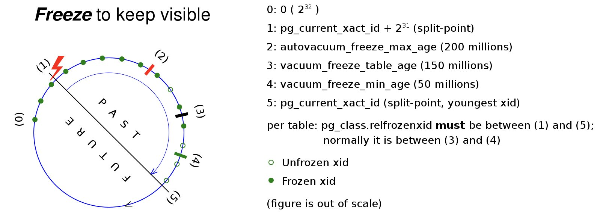

Originally from: [tweet](https://twitter.com/samokhvalov/status/1722585894430105822), [LinkedIn post]().

---

# How to monitor transaction ID wraparound risks

> I post a new PostgreSQL "howto" article every day. Join me in this
> journey – [subscribe](https://twitter.com/samokhvalov/), provide feedback, share!

Transaction ID and MultiXact ID wraparound – one of the worst incidents that can happen with a Postgres database.
Infamous cases:

- [Sentry (2015)](https://blog.sentry.io/transaction-id-wraparound-in-postgres/)
- [Joyent (2015)](https://tritondatacenter.com/blog/manta-postmortem-7-27-2015)
- [Mailchimp (2019)](https://mailchimp.com/what-we-learned-from-the-recent-mandrill-outage/)

Good resources of knowledge:

- [Postgres docs](https://postgresql.org/docs/current/routine-vacuuming.html#VACUUM-FOR-WRAPAROUND)
- Hironobu Suzuki's book "The Internals of PostgreSQL": [Vacuum Processing](https://interdb.jp/pg/pgsql06.html)
- Egor Rogov's book "PostgreSQL 14 Internals"
- [PostgreSQL/Wraparound and Freeze](https://en.wikibooks.org/wiki/PostgreSQL/Wraparound_and_Freeze)

There are two specific types of metrics that every monitoring setup must include (along with proper alerts):

1. The oldest XID and MultiXID (a.k.a. MultiXact ID) values used in non-frozen tuples
2. Monitoring for `xmin` horizon

Here we discuss the former.

## 32-bit XIDs

XIDs and MultiXact IDs are 32-bit, so the overall space size is 2<sup>32</sup> ≈ 4.2B. But due to modulo arithmetic
used, there is a concept of "the future" for XIDs – one half of the space is considered the past, another half is the
future. Thus, the capacity we need to monitor is 2<sup>31</sup> ≈ 2.1B.

An illustration
from [Wikipedia "wraparound and freeze"](https://en.wikibooks.org/wiki/PostgreSQL/Wraparound_and_Freeze):



To prevent XID/MultiXID wraparound, `autovacuum`, among other tasks, regularly performs "freezing" of old tuples,
marking tuples as frozen, meaning that these tuples belong to the past.

Therefore, monitoring the tuple XID/MultiXID ages is crucial to control the wraparound risks.

## XID and MultiXID wraparound risk monitoring

The most common approach:

- Checking `pg_database.datfrozenxid` helps understand how well `autovacuum` performs its "freezing" duties, replacing
  old XIDs in tuples, at high level.
- For further drill down, `pg_class.relfrozenxid` can be inspected for each relation.
- XIDs are numbers, and to compare these values with the current XID, function `age(...)` can be used.

Another type of risk also worth checking (usually missing in observability tools) is
[MultiXact ID wraparound](https://postgresql.org/docs/current/routine-vacuuming.html#VACUUM-FOR-MULTIXACT-WRAPAROUND).

- `pg_database` has `datminmxid`
- `pg_class` has `relminmxid`
- instead of `age(...)`, we need to use `mxid_age(...)`.

An example of high-level (databases) cluster-wide monitoring query:

```sql
with data as (
  select
    oid,
    datname,
    age(datfrozenxid) as xid_age,
    mxid_age(datminmxid) as mxid_age,
    pg_database_size(datname) as db_size
  from pg_database
)
select
  *,
  pg_size_pretty(db_size) as db_size_hr
from data
order by greatest(xid_age, mxid_age) desc;
```

And at table-level inside a particular database, TOP-25:

```sql
with data as (
  select
    format(
      '%I.%I',
      nspname,
      c.relname
    ) as table_name,
    greatest(age(c.relfrozenxid), age(t.relfrozenxid)) as xid_age,
    greatest(mxid_age(c.relminmxid), mxid_age(t.relminmxid)) as mxid_age,
    pg_table_size(c.oid) as table_size,
    pg_table_size(t.oid) as toast_size
  from pg_class as c
  join pg_namespace pn on pn.oid = c.relnamespace
  left join pg_class as t on c.reltoastrelid = t.oid
  where c.relkind in ('r', 'm')
)
select *
from data
order by greatest(xid_age, mxid_age) desc
limit 25;
```

## Alerts

If we ages grow above certain threshold (usually 200M, see
[autovacuum_freeze_max_age](https://postgresqlco.nf/doc/en/param/autovacuum_freeze_max_age/)), this is a sign that
something is blocking normal autovacuum work.

Therefore, depending on the autovacuum settings, monitoring systems have to be configured to issue alerts for the tuple
XID and MultiXID age values exceeding predefined thresholds in range 300M-1B. Values above 1B have to be considered
dangerous, requiring urgent mitigation actions.
