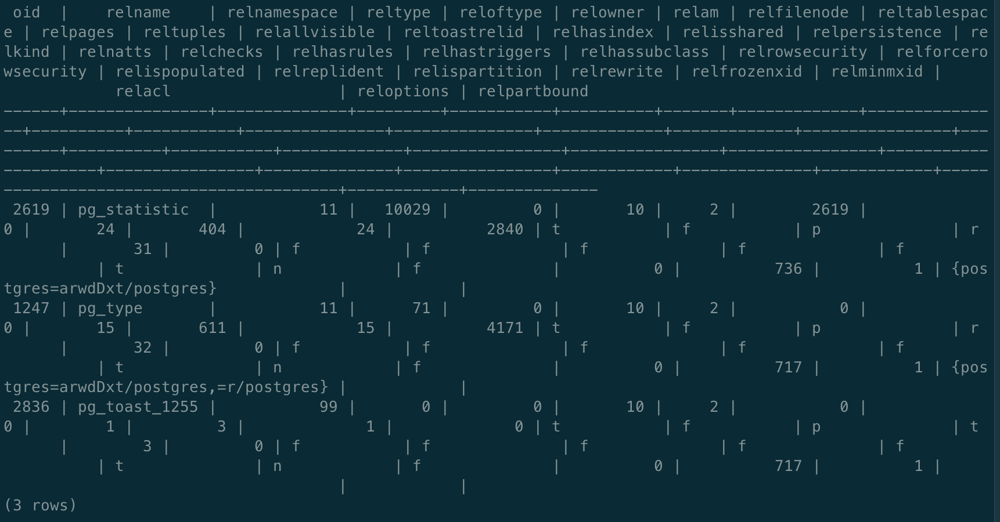
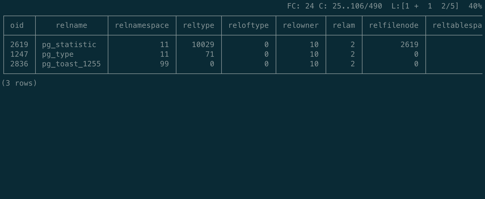
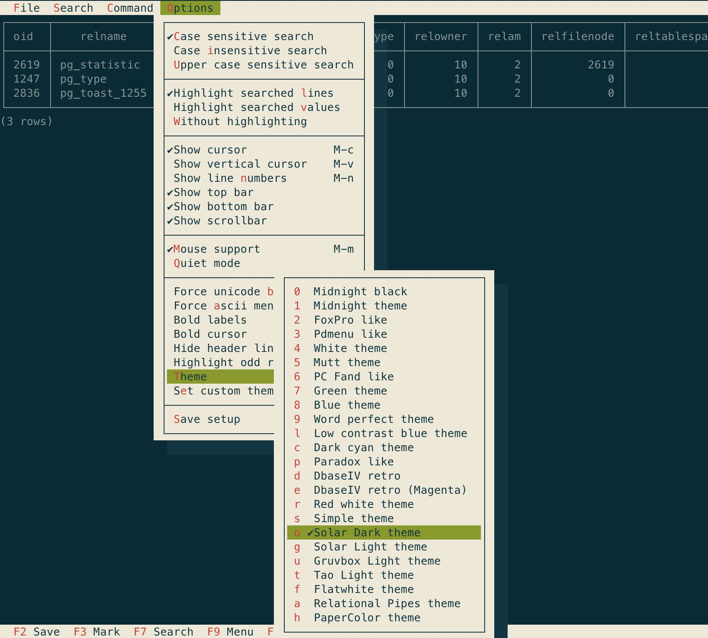
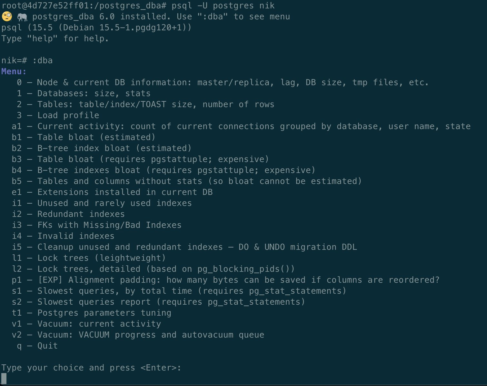

Originally from: [tweet](https://twitter.com/samokhvalov/status/1727982234119090364), [LinkedIn post]().

---

# psql tuning

> I post a new PostgreSQL "howto" article every day. Join me in this
> journey – [subscribe](https://twitter.com/samokhvalov/), provide feedback, share!

## .psqlrc

The file `~/.psqlrc` can be used to set some settings by default. For example:

```bash
echo '\timing on' >> ~/.psqlrc
```

Now if we start `psql`:

```sql
❯ psql -U postgres
Timing is on.
psql (15.5 (Debian 15.5-1.pgdg120+1))
Type "help" for help.

nik=# select pg_sleep(.5);
 pg_sleep
----------

(1 row)

Time: 508.187 ms
```

❗**Important:** for scripting involving `psql`, it is a good idea to use the option `-X` – to ignore `~/.psqlrc` 
settings, so the logic (e.g., `psql` output analysis) won't depend on `~/.psqlrc` at all.

## pspg

[pspg](https://github.com/okbob/pspg) is awesome. If you can, install it.

For example, for the query `select * from pg_class limit 3;`, before installation:



After installation:





To install:

- on macOS/homebrew: `brew install pspg`
- Ubuntu/Debian: `sudo apt update && sudo apt install -y pspg`

Then:

```bash
echo "\setenv PAGER pspg
\pset border 2
\pset linestyle unicode
\set x '\setenv PAGER less'
\set xx '\setenv PAGER \'pspg -bX --no-mouse\''
" >> ~/.psqlrc
```

## NULLs

By default, `NULL`s are invisible in `psql` output:

```sql
nik=# select null;
 ?column?
----------

(1 row)
```

To fix it (put it to `~/.psqrc` for persistency):

```sql
\pset null 'Ø'
```

Now:

```
nik=# select null;
 ?column?
----------
 Ø
(1 row)
```

## postgres_dba

[postgres_dba](https://github.com/NikolayS/postgres_dba) is my collection of scripts for `psql`, with menu support:


