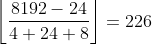
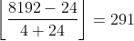

Originally from: [tweet](https://twitter.com/samokhvalov/status/1730609033860858080), [LinkedIn post]().

---

# How many tuples can be inserted in a page

> I post a new PostgreSQL "howto" article every day. Join me in this
> journey – [subscribe](https://twitter.com/samokhvalov/), provide feedback, share!

In Postgres, all tables have hidden, system columns; `ctid` being one of them. Reading it, we can see physical
location of the tuple (tuple = row physical version), the page number and offset inside it:

```sql
nik=# create table t0 as select 1 as id;
SELECT 1

nik=# select ctid, id from t0;
 ctid  | id
-------+----
 (0,1) |  1
(1 row)
```

👉 page 0, position 1.

A single PostgreSQL page, which is 8 KiB by default, and can be checked by looking at `block_size`:

```sql
nik=# show block_size;
 block_size
------------
 8192
(1 row)
```

How many tuples can fit into a single page? Let's see:

```sql
nik=# create table t0 as select i
from generate_series(1, 1000) as i;
SELECT 1000

nik=# select count(*)
from t0
where (ctid::text::point)[0] = 0;
 count
-------
   226
(1 row)

nik=# select pg_column_size(i) from t0 limit 1;
 pg_column_size
----------------
              4
(1 row)
```

👉 If we use 4-byte numbers, then it's 226 tuples. Here I used `(ctid::text::point)[0]` to convert `ctid` value to 
"point" to get the first its component, then (the page number).

If we use 2-byte numbers or, say, 1-byte `boolean` values (yes, boolean needs 1 byte, not 1 bit), the number is the
same:

```sql
nik=# drop table t0;
DROP TABLE
    
nik=# create table t0 as select true
from generate_series(1, 1000) as i;
SELECT 1000
    
nik=# select count(*)
  from t0
  where (ctid::text::point)[0] = 0;
 count
-------
   226
(1 row)
```

Why 226 again? The thing is that, the size of the value doesn't matter here; it just needs to be less or equal to 8
bytes. For every row, alignment padding adds zeroes, so we'll always have 8 bytes for each row. Math:



👉 What we have counted here:

1. A single 24-byte page header (`PageHeaderData`).
2. N pointers to each tuple – 4 bytes each (`ItemIdData`).
3. N tuple headers – 23 bytes each, padded to 24 (`HeapTupleHeaderData`).
4. N tuple values – if <= 8 bytes, then it's padded to 8 bytes.

Source code defining the
structures (for [PG16](https://github.com/postgres/postgres/blob/REL_16_STABLE/src/include/storage/bufpage.h)).

**Can we fit even MORE tuples?**

The answer is YES. Postgres allows tables without columns (!)  In this case, the math is:



Let's see (note the empty column list in the `SELECT` clause):

```sql
nik=# create table t0 as select
from generate_series(1, 1000) as i;
SELECT 1000

nik=# select count(*)
from t0
where (ctid::text::point)[0] = 0;
 count
-------
   291
(1 row)
```
