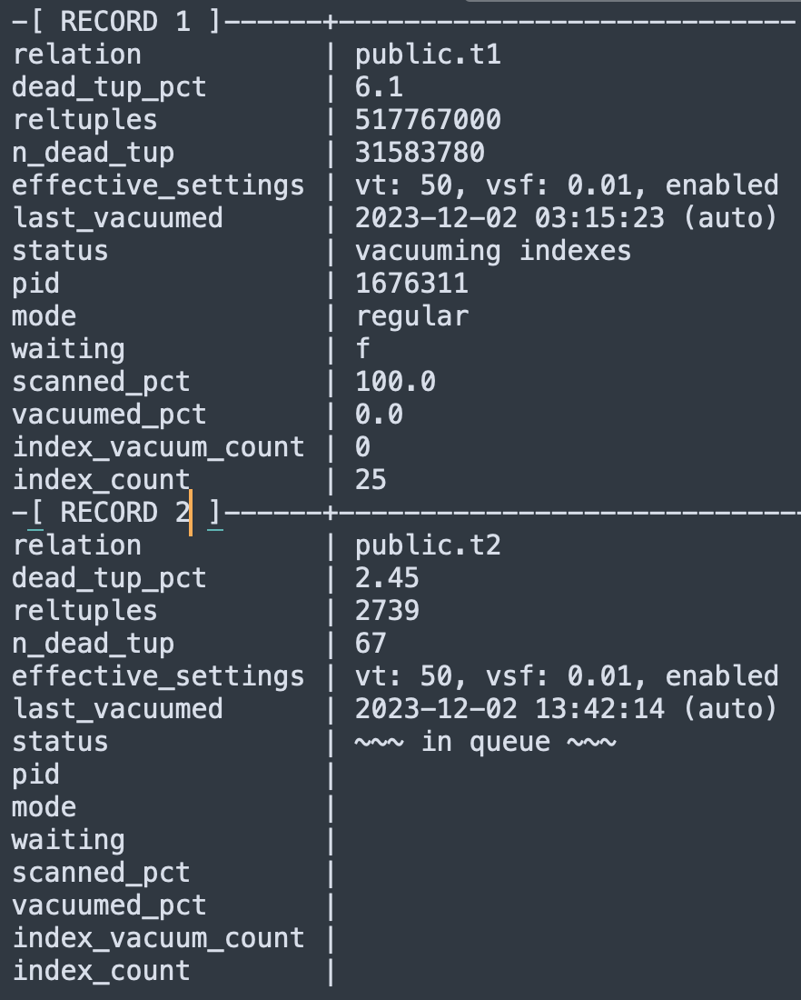

Originally from: [tweet](https://twitter.com/samokhvalov/status/1730979356363882889), [LinkedIn post]().

---

# Autovacuum "queue" and progress

> I post a new PostgreSQL "howto" article every day. Join me in this
> journey – [subscribe](https://twitter.com/samokhvalov/), provide feedback, share!

We know that in some cases, `autovacuum` settings (especially if they are default) need to be adjusted to keep up 
with the updates. One of the ways to understand that the existing settings are "not enough" is to compare
[autovacuum_max_workers](https://postgresqlco.nf/doc/en/param/autovacuum_max_workers/) and the number of workers
actually used:

```sql
show autovacuum_max_workers;

select
  state,
  count(*),
  array_agg(left(query, 25) order by xact_start)
from pg_stat_activity
where backend_type = 'autovacuum worker'
group by state;
```

👉 If most of the time, we see that the number of workers currently acting reaches `autovacuum_max_workers`, this 
is a strong signal that it's time to consider increasing the number of workers (requires a restart) and/or make them 
move faster – via [adjusting quotas](https://www.postgresql.org/docs/current/runtime-config-autovacuum.html) 
(<code><b>[auto]vacuum_vacuum_cost_limit</b></code>/<code>[auto]vacuum_vacuum_cost_delay</code>).

However, we might have a question: how many tables are currently in the "queue" to be processed by `autovacuum`? The
analysis of this "queue" can give an idea how much work the workers need to do and if the current settings are "enough".
The size of the queue compared to the number workers, potentially, can give a metric similar to "load average" for CPU
load.

Below is the report ([source](https://gitlab.com/-/snippets/1889668)) that answers it, by looking at:

- current global `autovacuum` settings,
- per-table individual settings for vacuuming,
- numbers of dead tuples for each table.

It compares all this and builds the list of tables that need vacuuming.

Additionally, it inspects `pg_stat_progress_vacuum` to analyze what's being processed right now.

The report has been derived from [here](https://github.com/avito-tech/dba-utils/blob/master/munin/vacuum_queue).

The further development of this query could include:
_analysis of tables "in need of being auto-analyzed"_.

```sql
with table_opts as (
    select
        pg_class.oid,
        relname,
        nspname,
        array_to_string(reloptions, '') as relopts
    from pg_class
             join pg_namespace ns on relnamespace = ns.oid
), vacuum_settings as (
    select
        oid,
        relname,
        nspname,
        case
            when relopts like '%autovacuum_vacuum_threshold%' then
                regexp_replace(relopts, '.*autovacuum_vacuum_threshold=([0-9.]+).*', e'\\1')::int8
            else current_setting('autovacuum_vacuum_threshold')::int8
            end as autovacuum_vacuum_threshold,
        case
            when relopts like '%autovacuum_vacuum_scale_factor%'
                then regexp_replace(relopts, '.*autovacuum_vacuum_scale_factor=([0-9.]+).*', e'\\1')::numeric
            else current_setting('autovacuum_vacuum_scale_factor')::numeric
            end as autovacuum_vacuum_scale_factor,
        case
            when relopts ~ 'autovacuum_enabled=(false|off)' then false
            else true
            end as autovacuum_enabled
    from table_opts
), p as (
    select *
    from pg_stat_progress_vacuum
)
select
    coalesce(
                coalesce(nullif(vacuum_settings.nspname, 'public') || '.', '') || vacuum_settings.relname, -- current DB
                format('[something in "%I"]', p.datname) -- another DB
    ) as relation,
    round((100 * psat.n_dead_tup::numeric / nullif(pg_class.reltuples, 0))::numeric, 2) as dead_tup_pct,
    pg_class.reltuples::numeric,
    psat.n_dead_tup,
    format (
            'vt: %s, vsf: %s, %s', -- 'vt' – vacuum_threshold, 'vsf' - vacuum_scale_factor
            vacuum_settings.autovacuum_vacuum_threshold,
            vacuum_settings.autovacuum_vacuum_scale_factor,
            (case when autovacuum_enabled then 'DISABLED' else 'enabled' end)
    ) as effective_settings,
    case
        when last_autovacuum > coalesce(last_vacuum, '0001-01-01') then left(last_autovacuum::text, 19) || ' (auto)'
        when last_vacuum is not null then left(last_vacuum::text, 19) || ' (manual)'
        else null
        end as last_vacuumed,
    coalesce(p.phase, '~~~ in queue ~~~') as status,
    p.pid as pid,
    case
        when a.query ~ '^autovacuum.*to prevent wraparound' then 'wraparound'
        when a.query ~ '^vacuum' then 'user'
        when a.pid is null then null
        else 'regular'
        end as mode,
    case
        when a.pid is null then null
        else coalesce(wait_event_type || '.' || wait_event, 'f')
        end as waiting,
    round(100.0 * p.heap_blks_scanned / nullif(p.heap_blks_total, 0), 1) as scanned_pct,
    round(100.0 * p.heap_blks_vacuumed / nullif(p.heap_blks_total, 0), 1) as vacuumed_pct,
    p.index_vacuum_count,
    case
        when psat.relid is not null and p.relid is not null then
                (select count(*) from pg_index where indrelid = psat.relid)
        else null
        end as index_count
from pg_stat_all_tables psat
         join pg_class on psat.relid = pg_class.oid
         left join vacuum_settings on pg_class.oid = vacuum_settings.oid
         full outer join p on p.relid = psat.relid and p.datname = current_database()
         left join pg_stat_activity a using (pid)
where
    psat.relid is null
   or p.phase is not null
   or (
            autovacuum_vacuum_threshold
            + (autovacuum_vacuum_scale_factor::numeric * pg_class.reltuples)
        < psat.n_dead_tup
    )
order by status, relation;
```

Example of the output (running it in psql with `\gx` instead of `;` in the end):


