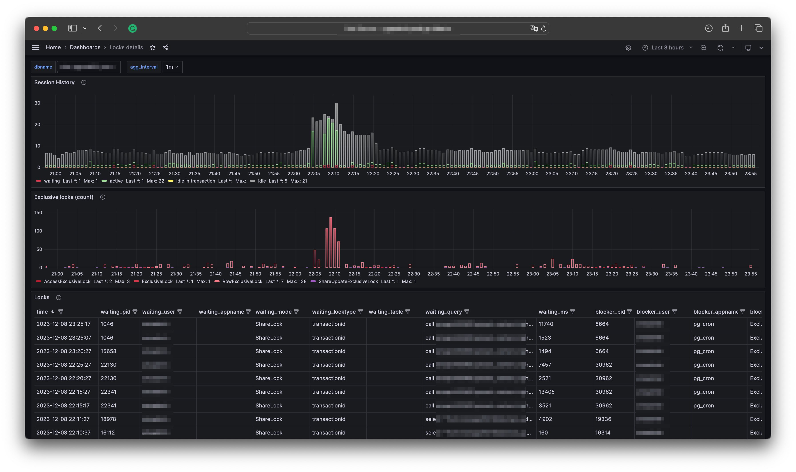
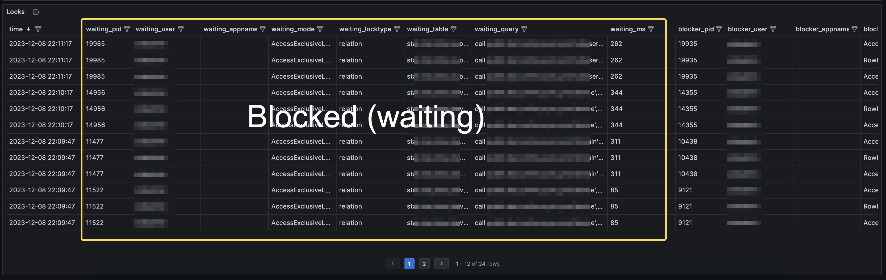
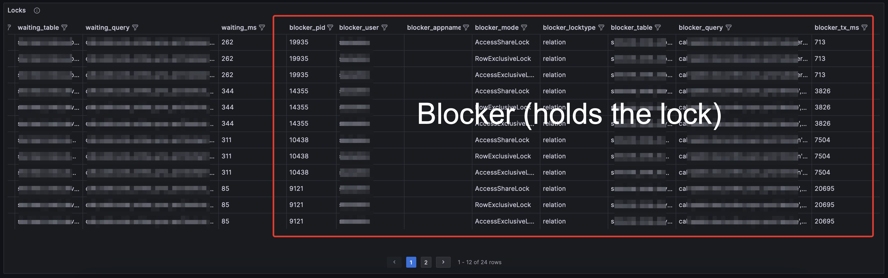

Originally from: [tweet](https://twitter.com/samokhvalov/status/1733252574479040950), [LinkedIn post]().

---

# How to analyze heavyweight locks, part 3. Persistent monitoring

> I post a new PostgreSQL "howto" article every day. Join me in this
> journey – [subscribe](https://twitter.com/samokhvalov/), provide feedback, share!

If a spike of active sessions (`pg_stat_activity`, `state='active'`) occurs along with a spike of exclusive locks
(`pg_locks`, `mode ~* 'exclusive'`), we need to analyze the blocked and blocking sessions, to understand the root cause.

Ad-hoc approaches were previously discussed:

- [Day 22, How to analyze heavyweight locks, part 1](0022_how_to_analyze_heavyweight_locks_part_1.md)
- [Day 42, How to analyze heavyweight locks, part 2: Lock trees (a.k.a. "lock queues", "wait queues", "blocking chains")](0042_how_to_analyze_heavyweight_locks_part_2.md)
- Specifically for the cases, when DDL is
  blocked: [Day 71, How to understand what's blocking DDL](0071_how_to_understand_what_is_blocking_ddl.md)

However, an ad-hoc approach is not helpful if the incident is already over. A big part of this is because even with
`log_lock_waits = 'on'`, Postgres logs report only the "victim" (blocked session) query text (in the `STATEMENT` part of
log entries), with only `PID` information available about the blocker session.

To troubleshoot past incidents and understand trends, we need lock analysis to be implemented in monitoring, providing
details about the blocked and blocking sessions.

Here is a query that [@VKukharik](https://twitter.com/VKukharik) developed for
the [pgwatch2 - Postgres.ai Edition](https://hub.docker.com/r/postgresai/pgwatch2). It doesn't involve
the function `pg_blocking_pids()` because it would be unsafe due to possible observer effect.

```sql
with sa_snapshot as (
  select *
  from pg_stat_activity
  where
    datname = current_database()
    and pid <> pg_backend_pid()
    and state <> 'idle'
)
select
  (extract(epoch from now()) * 1e9)::bigint as epoch_ns,
  waiting.pid as waiting_pid,
  waiting_stm.usename::text as tag_waiting_user,
  waiting_stm.application_name::text as tag_waiting_appname,
  waiting.mode as waiting_mode,
  waiting.locktype as waiting_locktype,
  waiting.relation::regclass::text as tag_waiting_table,
  waiting_stm.query as waiting_query,
  (extract(epoch from (now() - waiting_stm.state_change)) * 1000)::bigint as waiting_ms,
  blocker.pid as blocker_pid,
  blocker_stm.usename::text as tag_blocker_user,
  blocker_stm.application_name::text as tag_blocker_appname,
  blocker.mode as blocker_mode,
  blocker.locktype as blocker_locktype,
  blocker.relation::regclass::text as tag_blocker_table,
  blocker_stm.query as blocker_query,
  (extract(epoch from (now() - blocker_stm.xact_start)) * 1000)::bigint as blocker_tx_ms
from pg_catalog.pg_locks as waiting
join sa_snapshot as waiting_stm on waiting_stm.pid = waiting.pid
join pg_catalog.pg_locks as blocker on
  waiting.pid <> blocker.pid
  and blocker.granted
  and waiting.database = blocker.database
  and (
    waiting.relation  = blocker.relation
    or waiting.transactionid = blocker.transactionid
  )
join sa_snapshot as blocker_stm on blocker_stm.pid = blocker.pid
where not waiting.granted;
```

With this added to monitoring, here is what can be observed there during incidents involving lock contention spikes:



And it has all the details available for both blocked and blocking sessions, supporting the troubleshooting and
root-cause analysis activities:




