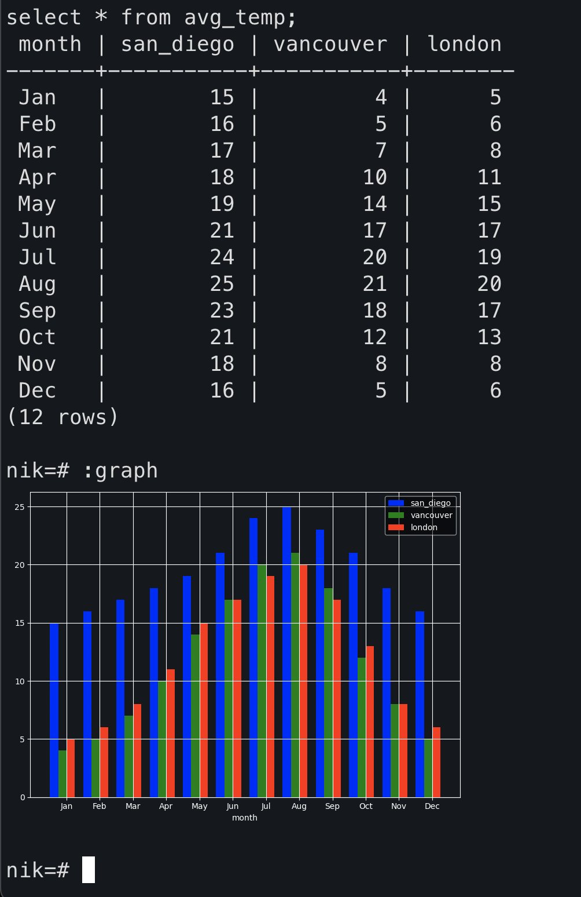

Originally from: [tweet](https://twitter.com/samokhvalov/status/1736301721155191218), [LinkedIn post]().

---

# How to plot graphs right in psql on macOS (iTerm2)

> I post a new PostgreSQL "howto" article every day. Join me in this
> journey – [subscribe](https://twitter.com/samokhvalov/), provide feedback, share!

If you, like me, work with Postgres mostly in psql, you might want to be able to plot a simple graph not leaving psql.

The recipe below was originally described by
[Alexander Korotkov](https://akorotkov.github.io/blog/2016/06/09/psql-graph/),
I [slightly adjusted it](https://gist.github.com/NikolayS/d5f1af808f7275dc1491c37fb1e2dd11) to work with Python3. The
recipe works thanks to [iTerm2's Inline Images Protocol](https://iterm2.com/documentation-images.html). For Linux, there
are various ways to achieve similar results
(see, for
example, [How do I make my terminal display graphical pictures?](https://askubuntu.com/questions/97542/how-do-i-make-my-terminal-display-graphical-pictures)).

1) Get the plotting script and install matplotlib:

   ```bash
   wget \
     -O ~/pg_graph.py \
     https://gist.githubusercontent.com/NikolayS/d5f1af808f7275dc1491c37fb1e2dd11/raw/4f19a23222a6f7cf66eead3cae9617dd39bf07a5/pg_graph
   
   pip install matplotlib
   ```

2) Define a macro in ~/.psqlrc (this line should work in bash, zsh, and csh):

   ```bash
   printf "%s %s %s %s %s %s\n" \\set graph \'\\\\g \| 
   python3 $(pwd)/pg_graph.py\' \
     >> ~/.psqlrc
   ```

3) Start psql and try it out

   ```sql
   nik=# with avg_temp(month, san_diego, vancouver, london) as (
       values
         ('Jan', 15, 4, 5),
         ('Feb', 16, 5, 6),
         ('Mar', 17, 7, 8),
         ('Apr', 18, 10, 11),
         ('May', 19, 14, 15),
         ('Jun', 21, 17, 17),
         ('Jul', 24, 20, 19),
         ('Aug', 25, 21, 20),
         ('Sep', 23, 18, 17),
         ('Oct', 21, 12, 13),
         ('Nov', 18, 8, 8),
         ('Dec', 16, 5, 6)
     )
     select * from avg_temp;
   
    month | san_diego | vancouver | london
   -------+-----------+-----------+--------
    Jan   |        15 |         4 |      5
    Feb   |        16 |         5 |      6
    Mar   |        17 |         7 |      8
    Apr   |        18 |        10 |     11
    May   |        19 |        14 |     15
    Jun   |        21 |        17 |     17
    Jul   |        24 |        20 |     19
    Aug   |        25 |        21 |     20
    Sep   |        23 |        18 |     17
    Oct   |        21 |        12 |     13
    Nov   |        18 |         8 |      8
    Dec   |        16 |         5 |      6
   (12 rows)
   
   nik=# :graph
   ```

   Result:

   
