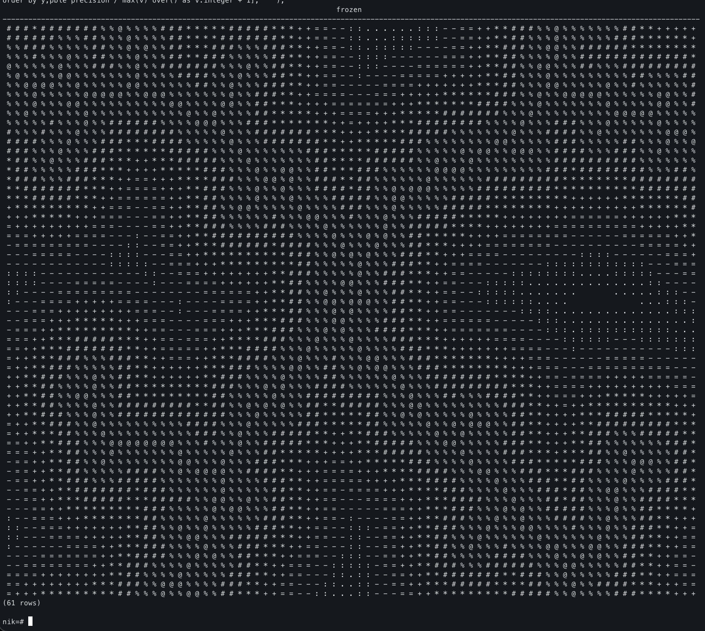
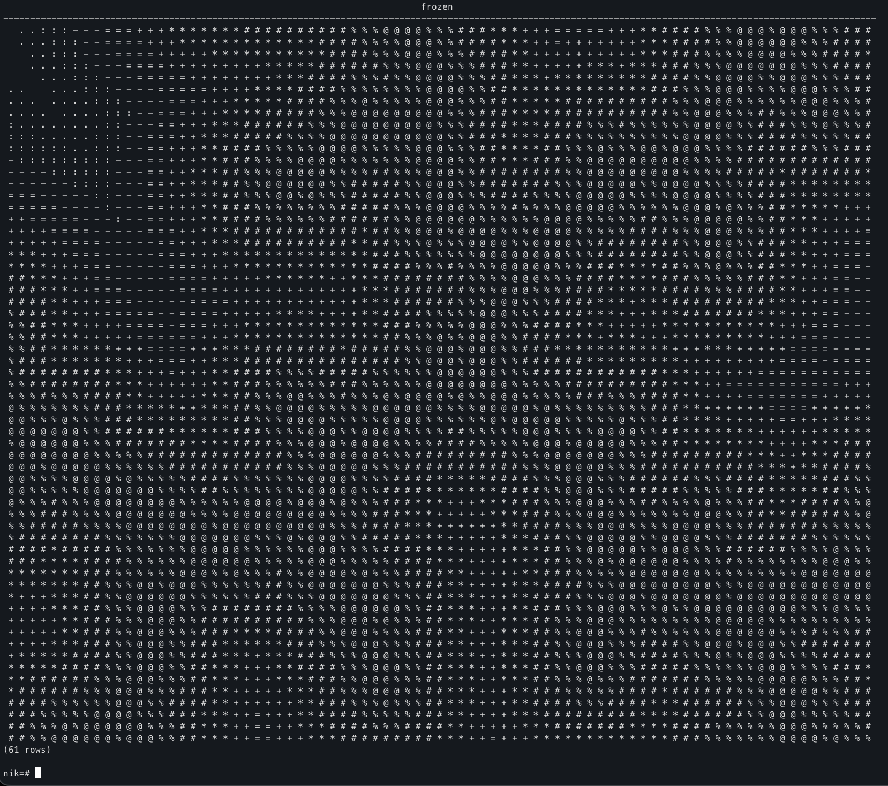
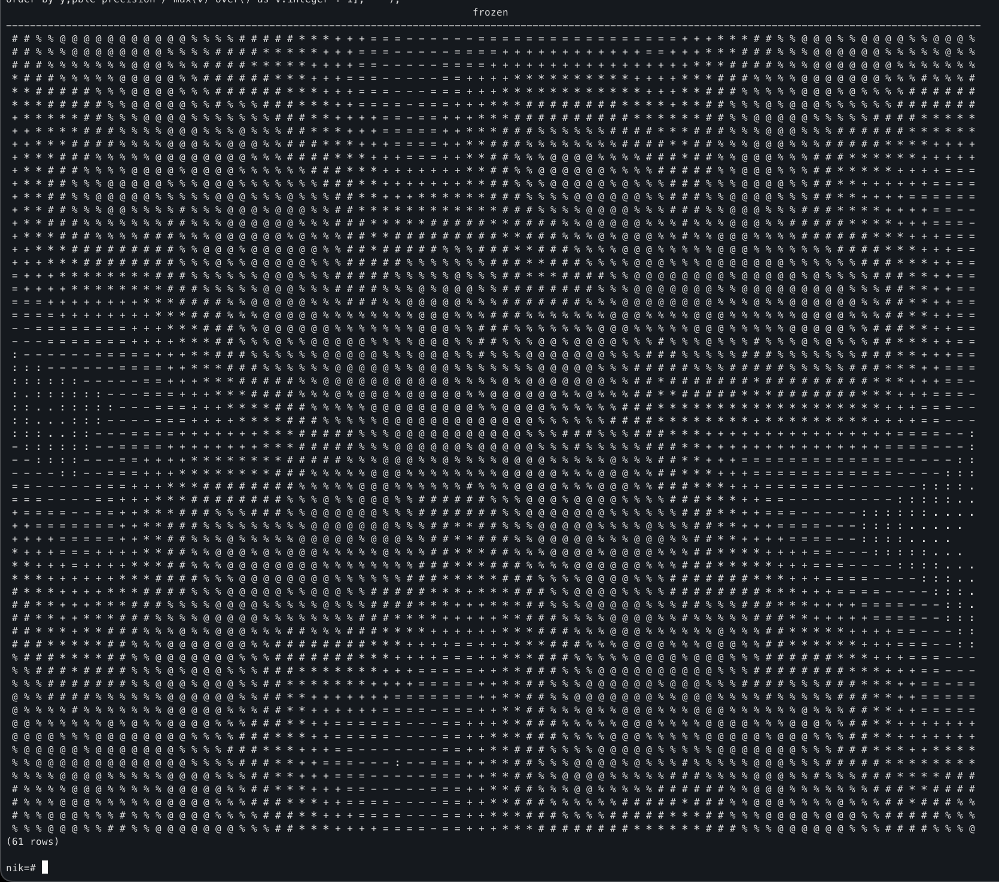

Originally from: [tweet](https://twitter.com/samokhvalov/status/1736637759073517684), [LinkedIn post]().

---

# How to draw frost patterns using SQL ❄️

> I post a new PostgreSQL "howto" article every day. Join me in this
> journey – [subscribe](https://twitter.com/samokhvalov/), provide feedback, share!

This original idea and implementation was done by Kirill Borovikov (kilor) – I just reformatted and slightly tuned it,
extending the character set.

Here is the query:

```sql
with recursive t as (
  select
    0 as x,
    0 as y,
    '{"{0,0}"}'::text[] as c,
    0 as i

  union all

  (
    with z as (
      select
        dn.x,
        dn.y,
        t.c,
        t.i
      from t,
      lateral (
        select
          ((random() * 2 - 1) * 100)::integer as x,
          ((random() * 2 - 1) * 100)::integer as y
      ) as p,
      lateral (
        select *
        from (
          select
            (unnest::text[])[1]::integer as x,
            (unnest::text[])[2]::integer as y
          from unnest(t.c::text[])
        ) as t
        order by sqrt((x - p.x) ^ 2 + (y - p.y) ^ 2)
        limit 1
      ) as n,
      lateral (
        select
          n.x + dx as x,
          n.y + dy as y
        from
          generate_series(-1, 1) as dx,
          generate_series(-1, 1) as dy
        where (dx, dy) <> (0, 0)
        order by
          case
            when (p.x, p.y) = (n.x, n.y) then 0
            else abs(
              acos(
                ((p.x - n.x) * dx + (p.y - n.y) * dy)
                / sqrt((p.x - n.x) ^ 2 + (p.y - n.y) ^ 2)
                / sqrt(dx ^ 2 + dy ^ 2)
              )
            )
          end
        limit 1
      ) as dn
    )
    select
      z.x,
      z.y,
      z.c || array[z.x, z.y]::text,
      z.i + 1
    from z
    where z.i < (1 << 10)
  )
),
map as (
  select
    gx as x,
    gy as y,
    (
      select sqrt((gx - T.x) ^ 2 + (gy - T.y) ^ 2) v
      from t
      order by v
      limit 1
    ) as v
  from
    generate_series(-40, 40) as gx,
    generate_series(-30, 30) as gy
),
gr as (
  select regexp_split_to_array('@%#*+=-:. ', '') as s
)
select
  string_agg(
    coalesce(s[(v * (array_length(s, 1) - 1))::integer + 1], ' '),
    ' '
    order by x
  ) as frozen
from
  (
    select
      x,
      y,
      v::double precision / max(v) over() as v
    from map
  ) as t,
  gr
group by y
order by y;
```

Every time it draws a new frozen pattern, here are several examples:







Happy holiday season 🎅
