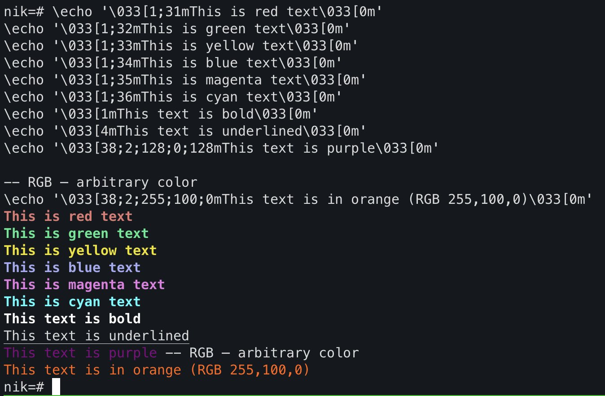

Originally from: [tweet](https://twitter.com/samokhvalov/status/1740257405198557348), [LinkedIn post]().

---

# How to format text output in psql scripts

> I post a new PostgreSQL "howto" article every day. Join me in this
> journey – [subscribe](https://twitter.com/samokhvalov/), provide feedback, share!

For `psql`'s `\echo` command, using colors and basic text formatting such as bold or underlined can be done through the
use of ANSI color codes. This can be useful when building complex scripts for `psql` (example:
[postgres_dba](https://github.com/NikolayS/postgres_dba/)).

Examples:

```
\echo '\033[1;31mThis is red text\033[0m'
\echo '\033[1;32mThis is green text\033[0m'
\echo '\033[1;33mThis is yellow text\033[0m'
\echo '\033[1;34mThis is blue text\033[0m'
\echo '\033[1;35mThis is magenta text\033[0m'
\echo '\033[1;36mThis is cyan text\033[0m'
\echo '\033[1mThis text is bold\033[0m'
\echo '\033[4mThis text is underlined\033[0m'
\echo '\033[38;2;128;0;128mThis text is purple\033[0m'

-- RGB – arbitrary color
\echo '\033[38;2;255;100;0mThis text is in orange (RGB 255,100,0)\033[0m'
```

Result:



**Important:** the `\033[0m` sequence resets the text formatting to the default.

The formatting is preserved in non-interactive mode of `psql`, and when combined with `ts` (to prefix timestamps, included
in the `moreutils` package in Ubuntu):

```bash
psql -Xc "\echo '\033[1;35mThis is magenta text\033[0m'" | ts
```

When `less` is used, formatting doesn't work – but it can be solved with option `-R`:

```bash
psql -Xc "\echo '\033[1;35mThis is magenta text\033[0m'" | less -R
```
